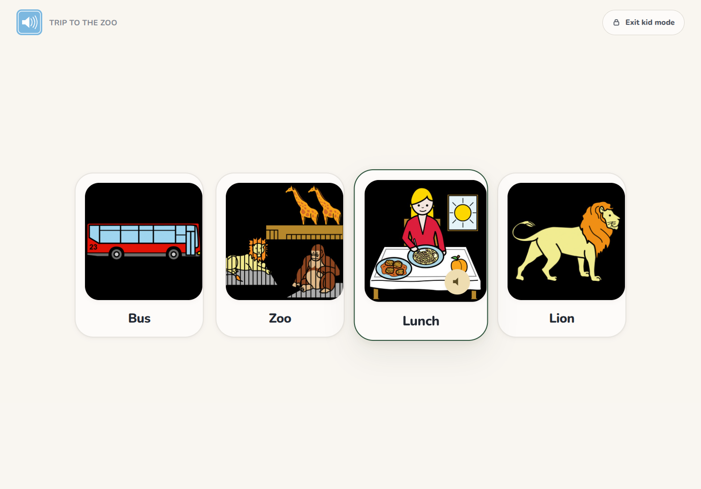
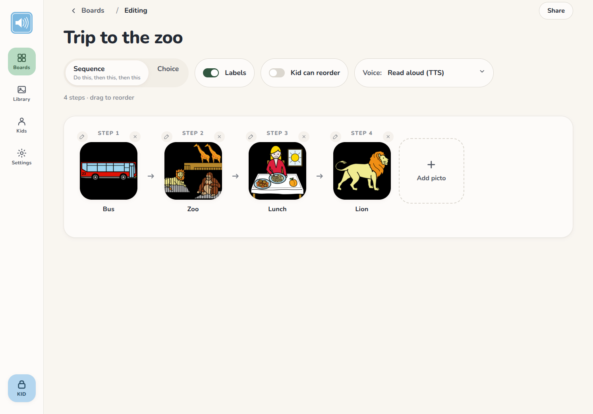
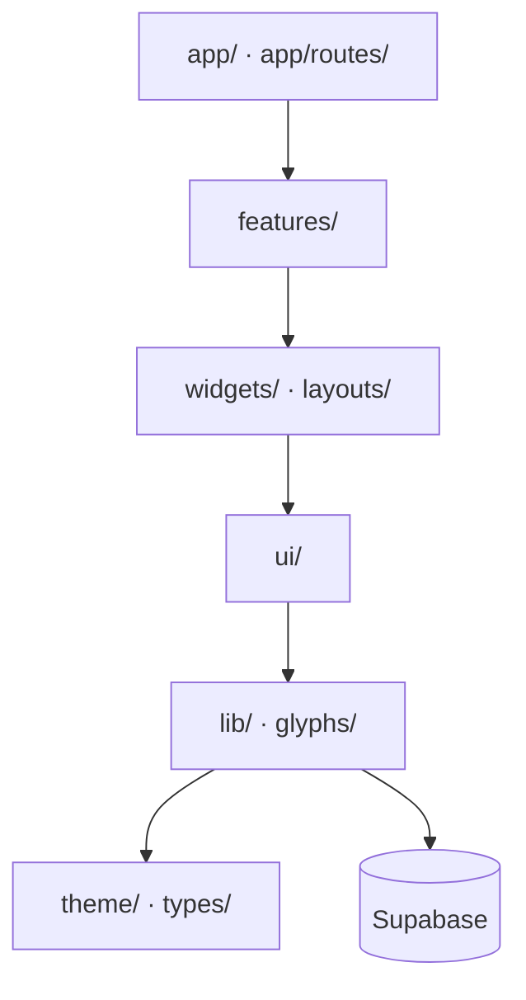

<p align="center">
  
</p>

# Talrum

A low-stim AAC (Augmentative & Alternative Communication) web app for non-verbal
autistic kids and their caregivers — a modernised PECS. Parents build small
picture boards; kids tap pictograms to communicate or make choices.



_Kid mode is the whole screen: cards, labels, nothing else. Tapping a card
reads it aloud._

Target surface: full-screen iPad in landscape (1194 × 834). On desktop, open
Chrome DevTools device mode at that viewport.

## Why it looks like this

Most AAC apps are busy — menus, badges, colour everywhere. For a child who is
easily overstimulated that's exactly wrong, which is part of why AAC practice
still runs on laminated paper cards. Talrum aims at the gap: as calm as paper,
but shareable, speakable, and still working when the tablet loses its
connection.

Concretely, "low-stim" means things were removed, not added. Kid mode and
parent mode are strictly separated: kid mode is tap-only and full-screen, with
no navigation, badges, or decoration, and a child can never land in parent UI
or have confusing text read aloud. Each board controls whether text labels
show and whether a tapped pictogram is spoken. And writes never block on the
network — a spinner a typical user shrugs at can mean real distress and
rejection of the tool here, so the UI updates optimistically and an outbox
replays the write when the connection returns.



_Parent mode: building a sequence board — labels on, kid-reorder off,
read-aloud voice picked per board._

The longer version — the architecture, the offline model, and the design
trade-offs — is written up at
[nbhansen.dk/2026-07-15-how-talrum-is-built](https://nbhansen.dk/2026-07-15-how-talrum-is-built/).

What has shipped and what's planned is tracked as epics and user stories in
[docs/user-stories.md](./docs/user-stories.md).

## Quick start

You need Node 22+, Docker, and the [Supabase CLI](https://github.com/supabase/cli/releases).

```sh
git clone <repo> && cd Talrum
npm install
cp .env.example .env.local           # paste keys from `supabase start`
supabase start                        # Postgres + Auth + Studio in Docker
supabase db reset                     # migrations + 4 demo boards
npm run dev
```

Open the URL Vite prints. Sign in with any email; grab the 6-digit OTP from
Mailpit at <http://127.0.0.1:54324> (Supabase's local SMTP catch-all;
the config.toml section is still named `[inbucket]` for historical reasons).
Supabase Studio is at <http://127.0.0.1:54323>.

## Commands

| What                 | How                 |
| -------------------- | ------------------- |
| Dev server           | `npm run dev`       |
| Typecheck            | `npm run typecheck` |
| Lint (zero warnings) | `npm run lint`      |
| Lint CSS tokens      | `npm run lint:css`  |
| Tests                | `npm run test`      |
| DB tests (pgTAP)     | `npm run test:db`   |
| Format               | `npm run format`    |
| Reset DB + reseed    | `supabase db reset` |
| Regenerate DB types  | `npm run types:db`  |

After editing a migration, run `supabase db reset && npm run types:db` and
commit both the migration and the regenerated `src/types/supabase.ts`.

## Architecture

The app is a single-page React app talking to Supabase (Postgres + Auth +
Storage) — the only external runtime dependency. Code is layered: a layer may
import from any layer below it, never above. ESLint enforces every boundary.



Top layer to bottom:

| Directory          | Role                                                                                                                                                                                    |
| ------------------ | --------------------------------------------------------------------------------------------------------------------------------------------------------------------------------------- |
| `app/`             | Composition root: router, AuthGate, SessionProvider, SW update prompt. `app/routes/` holds one file per route, composed from features.                                                  |
| `features/`        | One folder per screen (parent-home, board-builder, kid-mode, …). Never import each other — composed at the route layer. Kid-mode PIN soft-gate: [docs/kid-mode.md](./docs/kid-mode.md). |
| `widgets/`         | Shared, query-aware, feature-agnostic components (PictogramSheet, KidSheet, NewKidModal, OfflineIndicator).                                                                             |
| `layouts/`         | ParentShell, KidModeLayout, TalrumLogo. Same tier as `widgets/` and may render them.                                                                                                    |
| `ui/`              | Domain-agnostic primitives (Button, Modal, PictoTile, …). No data access — a component that needs `lib/queries` or `lib/outbox` belongs in `widgets/`.                                  |
| `lib/`             | Queries (reads), outbox (writes), storage URL minting, auth helpers, speech/TTS + app-language helpers ([docs/speech.md](./docs/speech.md)).                                            |
| `glyphs/`          | Hand-drawn inline-SVG glyph set (`GlyphName` → SVG, theme-var strokes). Same tier as `lib/`; distinct from photo pictograms, which live in Supabase Storage.                            |
| `theme/`, `types/` | CSS design tokens; domain types + generated `supabase.ts` (regenerate with `npm run types:db`, never edit).                                                                             |
| `supabase/`        | Outside `src/`: config, migrations, seed.sql, pgTAP tests, edge functions.                                                                                                              |

Data-access rules — pinned by `no-restricted-imports` / `no-restricted-syntax`
in `eslint.config.js`:

- DB reads go through `src/lib/queries/*` (react-query hooks) — conventions
  and the write-pattern decision guide are in
  [docs/queries.md](./docs/queries.md).
- Writes go through `src/lib/outbox` (offline-tolerant queue) — the full
  write-path lifecycle is in [docs/outbox.md](./docs/outbox.md); the
  read-side persisted cache and its auth-boundary wipe are in
  [docs/offline-cache.md](./docs/offline-cache.md).
- Storage URL minting goes through `src/lib/storage`
  ([docs/storage.md](./docs/storage.md)).
- Auth subscription is centralized in `src/app/AuthGate`; sign-in/out helpers
  live in `src/lib/auth/`.

Colors in `*.module.css` outside `src/theme/` must come from theme tokens —
hex/rgb/hsl literals are blocked by `npm run lint:css` (stylelint). The same
guard blocks raw `px` in `padding`, `margin`, `gap`, and their longhand
variants — use `--tal-space-N` tokens instead. Documented holdouts (negative
pulls, border-compensated paddings, sub-scale 2px hairlines) carry an
inline `stylelint-disable-next-line` comment naming the reason.

## Auth

Email-OTP via Supabase. The full flow and how to read OTPs locally are in
[docs/auth.md](./docs/auth.md).

## Deployment

Backend is a Supabase Cloud project. The web SPA deploys to Cloudflare Pages.
Mobile clients use the Supabase SDK and hit the same project. Path to a
self-hosted Supabase on a VPS is in [docs/self-hosting.md](./docs/self-hosting.md).

**One-time setup**

1. Create a Supabase Cloud project. From _Project Settings → API_ note the
   project ref, project URL, and anon key. From _Account → Access Tokens_
   generate a personal access token for CI.
2. From your machine, link and push the existing migrations once:
   ```sh
   supabase login
   supabase link --project-ref <project-ref>
   supabase db push
   ```
3. In GitHub _Settings → Secrets and variables → Actions_ add:
   - `SUPABASE_ACCESS_TOKEN` (the PAT)
   - `SUPABASE_PROJECT_REF` (the ref)
   - `SUPABASE_DB_PASSWORD` (Postgres password from the dashboard)
   - `VITE_SENTRY_DSN` (Sentry project DSN; build embeds it in the prod bundle)
   - `SENTRY_AUTH_TOKEN` (Sentry org auth token with `project:releases` scope)
   - `SENTRY_ORG` / `SENTRY_PROJECT` (org slug + project slug for source-map upload)
4. In Cloudflare Pages, connect the repo with build command `npm run build`,
   output directory `dist`, production branch `main`. Add build env vars
   `VITE_SUPABASE_URL` and `VITE_SUPABASE_ANON_KEY` (see
   `.env.production.example`).
5. In Supabase _Auth → URL Configuration_ set the Site URL to the Cloudflare
   Pages URL and add the mobile app deep-link to Additional Redirect URLs.

**Per release**

`git push origin main` runs `.github/workflows/deploy.yml`, which deploys
in order:

1. **Migrations** — `supabase db push --linked` (retried once on transient
   failure), then an assertion that the remote schema matches local
   migrations.
2. **SPA** — built and pushed to Cloudflare Pages, but only if the
   migration job succeeded, so the deployed frontend is never newer than
   the schema it talks to.

A failed migration job skips the SPA deploy (prod keeps serving the
previous release) and files a GitHub issue. After fixing the cause,
re-deploy with `gh workflow run deploy`.

Nothing deploys on PRs — both halves run only on push to `main`.

**Rollback**

- SPA: Cloudflare Pages → previous deployment → _Rollback_ (instant).
- Schema: revert the migration commit; CI applies the revert. Destructive
  migrations need a forward-only undo migration — Postgres has no built-in
  rollback for already-applied DDL.

**Observability**

Production builds report errors to Sentry via `src/lib/telemetry.ts`. Dev
builds and any build missing `VITE_SENTRY_DSN` no-op silently. Posture:

- `sendDefaultPii: false`, no session replay, no traces — errors only.
- `beforeSend` drops `event.user.email` and strips breadcrumb messages
  longer than 120 chars (board names + pictogram labels are short; the cap
  catches long user-content leaks without scrubbing legit stack frames).
- Source maps are uploaded to Sentry during the CF Pages build and deleted
  from `dist/` before deploy, so unminified traces appear in the Sentry
  dashboard but `.map` files are never served from Pages.

## Conventions

Strict TypeScript. Edit existing files before adding new ones. Delete dead
code instead of leaving it. Tests assert what users see, not internal state.
See [AGENTS.md](./AGENTS.md) for the full operating rules.
