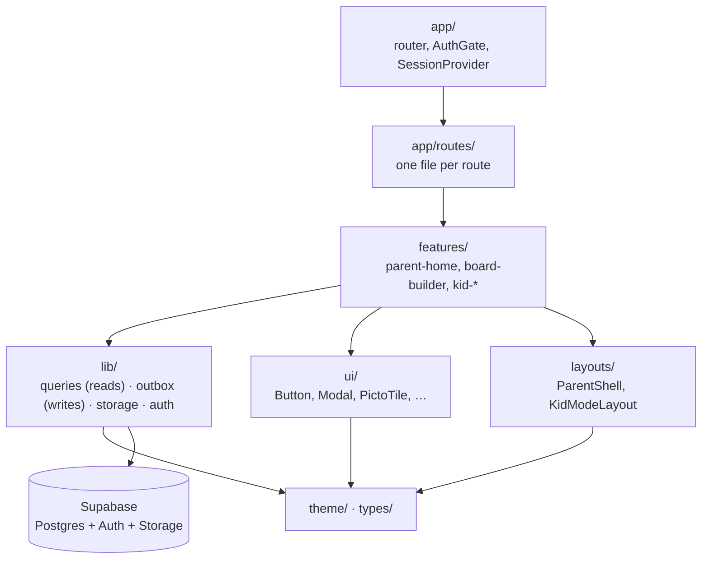

<p align="center">
  
</p>

# Talrum

A low-stim AAC (Augmentative & Alternative Communication) web app for non-verbal
autistic kids and their caregivers — a modernised PECS. Parents build small
picture boards; kids tap pictograms to communicate or make choices.

Target surface: full-screen iPad in landscape (1194 × 834). On desktop, open
Chrome DevTools device mode at that viewport.

## Quick start

You need Node 22+, Docker, and the [Supabase CLI](https://github.com/supabase/cli/releases).

```sh
git clone <repo> && cd Talrum
npm install
cp .env.example .env.local           # paste keys from `supabase start`
supabase start                        # Postgres + Auth + Studio in Docker
supabase db reset                     # migrations + 4 demo boards
npm run dev
```

Open the URL Vite prints. Sign in with any email; grab the 6-digit OTP from
Inbucket at <http://127.0.0.1:54324> (Supabase's local SMTP catch-all).
Supabase Studio is at <http://127.0.0.1:54323>.

## Commands

| What                 | How                 |
| -------------------- | ------------------- |
| Dev server           | `npm run dev`       |
| Typecheck            | `npm run typecheck` |
| Lint (zero warnings) | `npm run lint`      |
| Tests                | `npm run test`      |
| Format               | `npm run format`    |
| Reset DB + reseed    | `supabase db reset` |
| Regenerate DB types  | `npm run types:db`  |

After editing a migration, run `supabase db reset && npm run types:db` and
commit both the migration and the regenerated `src/types/supabase.ts`.

## Architecture

The app is a single-page React app talking to Supabase (Postgres + Auth +
Storage). Code is layered: top layers may import from layers below, never the
reverse. ESLint enforces this.



Data-access rules — pinned by `no-restricted-imports` / `no-restricted-syntax`
in `eslint.config.js`:

- DB reads go through `src/lib/queries/*` (react-query hooks).
- Writes go through `src/lib/outbox` (offline-tolerant queue).
- Storage URL minting goes through `src/lib/storage`.
- Auth subscription is centralized in `src/app/AuthGate`; sign-in/out helpers
  live in `src/lib/auth/`.
- `features/` never cross-import each other — compose at the route layer.

Directory map:

```
src/
  app/         router, AuthGate, SessionProvider, SW update prompt
  app/routes/  one file per route, composed from features
  features/    one folder per screen (parent-home, board-builder, kid-*)
  lib/         supabase client, react-query hooks, outbox, auth helpers
  ui/          domain-agnostic primitives (Button, Modal, PictoTile, …)
  layouts/     ParentShell, KidModeLayout, TalrumLogo
  theme/       CSS custom properties + typed token re-exports
  types/       domain types + generated supabase.ts (do not edit)
supabase/      config, migrations, seed.sql, pgTAP tests, edge functions
```

Colors in `*.module.css` outside `src/theme/` must come from theme tokens —
hex/rgb/hsl literals are blocked by `npm run lint:css` (stylelint). The same
guard blocks raw `px` in `padding`, `margin`, `gap`, and their longhand
variants — use `--tal-space-N` tokens instead. Documented holdouts (negative
pulls, border-compensated paddings, sub-scale 2px hairlines) carry an
inline `stylelint-disable-next-line` comment naming the reason.

## Auth

Email-OTP via Supabase. The full flow and how to read OTPs locally are in
[docs/auth.md](./docs/auth.md).

## Deployment

Backend is a Supabase Cloud project. The web SPA deploys to Cloudflare Pages.
Mobile clients use the Supabase SDK and hit the same project. Path to a
self-hosted Supabase on a VPS is in [docs/self-hosting.md](./docs/self-hosting.md).

**One-time setup**

1. Create a Supabase Cloud project. From _Project Settings → API_ note the
   project ref, project URL, and anon key. From _Account → Access Tokens_
   generate a personal access token for CI.
2. From your machine, link and push the existing migrations once:
   ```sh
   supabase login
   supabase link --project-ref <project-ref>
   supabase db push
   ```
3. In GitHub _Settings → Secrets and variables → Actions_ add:
   - `SUPABASE_ACCESS_TOKEN` (the PAT)
   - `SUPABASE_PROJECT_REF` (the ref)
   - `SUPABASE_DB_PASSWORD` (Postgres password from the dashboard)
4. In Cloudflare Pages, connect the repo with build command `npm run build`,
   output directory `dist`, production branch `main`. Add build env vars
   `VITE_SUPABASE_URL` and `VITE_SUPABASE_ANON_KEY` (see
   `.env.production.example`).
5. In Supabase _Auth → URL Configuration_ set the Site URL to the Cloudflare
   Pages URL and add the mobile app deep-link to Additional Redirect URLs.

**Per release**

`git push origin main` does both halves:

- `.github/workflows/deploy-migrations.yml` runs `supabase db push --linked`
  whenever `supabase/migrations/**` changes.
- Cloudflare Pages rebuilds and deploys the SPA on every push.

PRs get Cloudflare preview URLs automatically. Migrations only deploy on
merge to `main`.

**Rollback**

- SPA: Cloudflare Pages → previous deployment → _Rollback_ (instant).
- Schema: revert the migration commit; CI applies the revert. Destructive
  migrations need a forward-only undo migration — Postgres has no built-in
  rollback for already-applied DDL.

## Conventions

Strict TypeScript. Edit existing files before adding new ones. Delete dead
code instead of leaving it. Tests assert what users see, not internal state.
See [AGENTS.md](./AGENTS.md) for the full operating rules.
