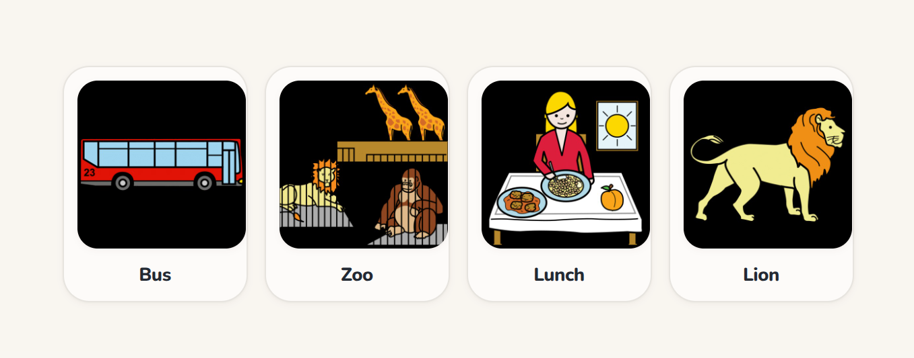
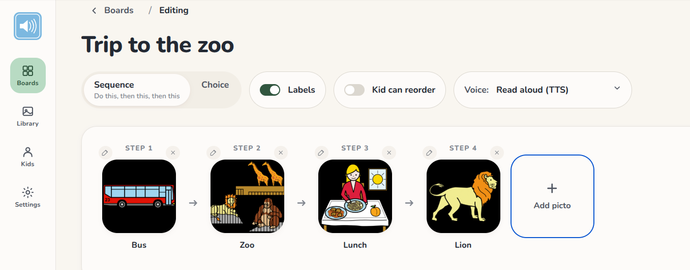
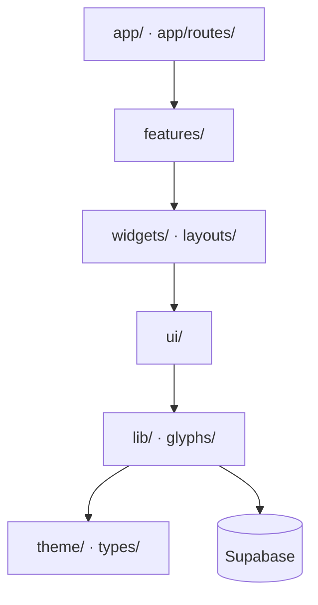
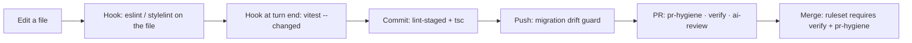

<p align="center">
  
</p>

# Talrum

A low-stim AAC (Augmentative & Alternative Communication) web app for non-verbal
autistic kids and their caregivers — a modernised PECS. Parents build small
picture boards; kids tap pictograms to communicate or make choices.



_Kid mode is the whole screen: cards, labels, nothing else. Tapping a card
reads it aloud._

Target surface: full-screen iPad in landscape (1194 × 834). On desktop, open
Chrome DevTools device mode at that viewport.

## Why it looks like this

Most AAC apps are busy — menus, badges, colour everywhere. For a child who is
easily overstimulated that's exactly wrong, which is part of why AAC practice
still runs on laminated paper cards. Talrum aims at the gap: as calm as paper,
but shareable, speakable, and still working when the tablet loses its
connection.

Concretely, "low-stim" means things were removed, not added. Kid mode and
parent mode are strictly separated: kid mode is tap-only and full-screen, with
no navigation, badges, or decoration, and a child can never land in parent UI
or have confusing text read aloud. Each board controls whether text labels
show and whether a tapped pictogram is spoken. And writes never block on the
network — a spinner a typical user shrugs at can mean real distress and
rejection of the tool here, so the UI updates optimistically and an outbox
replays the write when the connection returns.



_Parent mode: building a sequence board — labels on, kid-reorder off,
read-aloud voice picked per board._

The longer version — the architecture, the offline model, and the design
trade-offs — is written up at
[nbhansen.dk/2026-07-15-how-talrum-is-built](https://nbhansen.dk/2026-07-15-how-talrum-is-built/).

What has shipped and what's planned is tracked as epics and user stories in
[docs/user-stories.md](./docs/user-stories.md).

## Quick start

You need Node 22+, Docker, and the [Supabase CLI](https://github.com/supabase/cli/releases).

```sh
git clone <repo> && cd Talrum
npm install
cp .env.example .env                  # paste the key from `supabase status`
supabase start                        # Postgres + Auth + Studio in Docker
supabase db reset                     # migrations + 4 demo boards
npm run dev
```

`npm run dev` always talks to local Supabase, and prints which project it is
pointed at on boot. To work against Supabase Cloud instead, copy
`.env.cloud.example` to `.env.cloud` and run `npm run dev:cloud` — a separate
command, so you can't drift onto real user data by forgetting a file. The full
local-vs-production picture is in
[docs/runbooks/deploy.md](./docs/runbooks/deploy.md#configuration-what-is-local-what-is-production);
the one rule worth memorising is **never run `supabase config push`** (it
rewrites prod's auth settings wholesale — see #215).

Open the URL Vite prints. Sign in with any email, then open the sign-in link
from Mailpit at <http://127.0.0.1:54324> (Supabase's local SMTP catch-all;
the config.toml section is still named `[inbucket]` for historical reasons).
Supabase Studio is at <http://127.0.0.1:54323>.

## Commands

| What                 | How                    |
| -------------------- | ---------------------- |
| Dev server           | `npm run dev`          |
| Typecheck            | `npm run typecheck`    |
| Lint (zero warnings) | `npm run lint`         |
| Lint CSS tokens      | `npm run lint:css`     |
| Lint comment length  | `npm run lint:comments`|
| Tests                | `npm run test`         |
| DB tests (pgTAP)     | `npm run test:db`      |
| Format               | `npm run format`       |
| Reset DB + reseed    | `supabase db reset`    |
| Regenerate DB types  | `npm run types:db`     |

After editing a migration, run `supabase db reset && npm run types:db` and
commit both the migration and the regenerated `src/types/supabase.ts`.

## Architecture

The app is a single-page React app talking to Supabase (Postgres + Auth +
Storage) — the only external runtime dependency. Code is layered: a layer may
import from any layer below it, never above. ESLint enforces every boundary.


```mermaid
flowchart TD
    app["app/ · app/routes/"] --> features["features/"]
    features --> shared["widgets/ · layouts/"]
    shared --> ui["ui/"]
    ui --> lib["lib/ · glyphs/"]
    lib --> tokens["theme/ · types/"]
    lib --> supa[(Supabase)]
```

## Auth

Email-OTP via Supabase. The full flow and how to read OTPs locally are in
[docs/auth.md](./docs/auth.md).

## Deployment

Backend is a Supabase Cloud project. The web SPA deploys to Cloudflare Pages.
Mobile clients use the Supabase SDK and hit the same project. Path to a
self-hosted Supabase on a VPS is in [docs/self-hosting.md](./docs/self-hosting.md).

**One-time setup**

1. Create a Supabase Cloud project. From _Project Settings → API_ note the
   project ref, project URL, and anon key. From _Account → Access Tokens_
   generate a personal access token for CI.
2. From your machine, link and push the existing migrations once:
   ```sh
   supabase login
   supabase link --project-ref <project-ref>
   supabase db push
   ```
3. In GitHub _Settings → Secrets and variables → Actions_ add:
   - `SUPABASE_ACCESS_TOKEN` (the PAT)
   - `SUPABASE_PROJECT_REF` (the ref; the build derives the project URL from it)
   - `SUPABASE_DB_PASSWORD` (Postgres password from the dashboard)
   - `VITE_SUPABASE_ANON_KEY` (anon / publishable key)
   - `CLOUDFLARE_API_TOKEN` / `CLOUDFLARE_ACCOUNT_ID` (for the Pages upload)
   - `VITE_SENTRY_DSN` (Sentry project DSN; build embeds it in the prod bundle)
   - `SENTRY_AUTH_TOKEN` (Sentry org auth token with `project:releases` scope)
   - `SENTRY_ORG` / `SENTRY_PROJECT` (org slug + project slug for source-map upload)

   These are the **only** place production's Supabase URL and key are
   configured.

4. Create the Cloudflare Pages project (`talrum`). Leave its build settings
   empty — Pages is used purely as static hosting. CI runs `npm run build`
   itself, with the `VITE_*` values above injected from the secrets, then
   uploads `dist` with `wrangler pages deploy`. Build env vars set in the
   Pages dashboard are never read.
5. In Supabase _Auth → URL Configuration_ set the Site URL to the Cloudflare
   Pages URL and add the mobile app deep-link to Additional Redirect URLs.
   The dashboard is the source of truth for production auth —
   `supabase/config.toml` configures local dev only, and must not be pushed
   (see [docs/runbooks/deploy.md](./docs/runbooks/deploy.md#configuration-what-is-local-what-is-production)).

**Per release**

`git push origin main` runs `.github/workflows/deploy.yml`, which deploys
in order:

1. **Migrations** — `supabase db push --linked` (retried once on transient
   failure), then an assertion that the remote schema matches local
   migrations.
2. **SPA** — built and pushed to Cloudflare Pages, but only if the
   migration job succeeded, so the deployed frontend is never newer than
   the schema it talks to.

A failed migration job skips the SPA deploy (prod keeps serving the
previous release) and files a GitHub issue. After fixing the cause,
re-deploy with `gh workflow run deploy`.

Nothing deploys on PRs — both halves run only on push to `main`.

**Rollback**

- SPA: Cloudflare Pages → previous deployment → _Rollback_ (instant).
- Schema: revert the migration commit; CI applies the revert. Destructive
  migrations need a forward-only undo migration — Postgres has no built-in
  rollback for already-applied DDL.

**Observability**

Production builds report errors to Sentry via `src/lib/platform/telemetry.ts`. Dev
builds and any build missing `VITE_SENTRY_DSN` no-op silently. Posture:

- `sendDefaultPii: false`, no session replay, no traces — errors only.
- `beforeSend` drops `event.user.email` and strips breadcrumb messages
  longer than 120 chars (board names + pictogram labels are short; the cap
  catches long user-content leaks without scrubbing legit stack frames).
- Source maps are uploaded to Sentry during the CF Pages build and deleted
  from `dist/` before deploy, so unminified traces appear in the Sentry
  dashboard but `.map` files are never served from Pages.

## Handing an iPad to a family

Do these steps in this order, on the family's iPad, before you hand it over.

1. **Add to Home Screen.** Open the app URL in Safari: Share → _Add to Home
   Screen_. Launch from the new icon: the app runs full screen in landscape.
2. **Sign in from the icon.** Enter the parent's email, open the email on
   the iPad, and type the code into the app.
3. **Verify the icon is signed in.** Close the app from the app switcher and
   launch it again from the icon. It must open on the parent home, not the
   login screen. If the email has no code, stop: a prod email template has
   lost `{{ .Token }}`. Fix it before the handover (#500).
4. **Set the parent PIN.** Settings → Parent PIN → _Set a PIN_. Without a
   PIN the device cannot enter kid mode at all. The PIN is per device, and
   signing out erases it.
5. **Load everything once while online.** Open every board and tap every
   pictogram so each photo shows and each sound plays. Only content never
   loaded on this device is unavailable offline.
6. **Prove offline works.** Turn on Airplane Mode, close and reopen the app,
   and open a board. If boards do not open, offline mode is not working on
   this device — the app does not warn about this itself (#377).
7. **Turn on Guided Access.** iPad Settings → Accessibility → Guided Access.
   Set a passcode that is different from the parent PIN. In the app,
   triple-click the top button to start it. Guided Access is what actually
   keeps a child inside the app; the parent PIN is a soft gate, not a lock
   (see [docs/kid-mode.md](./docs/kid-mode.md)).
8. **Agree on how to report problems.** Ask the family to note what
   happened and the time of day. Telemetry records errors without personal
   data, so the time is what connects their report to a stack trace.

## Harness

A rule in text does not stop a wrong change. A check does. The harness is the
set of checks that run between an edit and a merge. Each check is silent when
it passes. Only a failure gives output. When a check enforces a rule, we delete
the rule from [AGENTS.md](./AGENTS.md); the text keeps only the rules that no
check can enforce.


```mermaid
flowchart LR
    edit["Edit a file"] --> hook["Hook: eslint / stylelint on the file"]
    hook --> turn["Hook at turn end: vitest --changed"]
    turn --> commit["Commit: lint-staged + tsc"]
    commit --> push["Push: migration drift guard"]
    push --> pr["PR: pr-hygiene · verify · ai-review"]
    pr --> merge["Merge: ruleset requires verify + pr-hygiene"]
```

| When                    | Check                                                                                                          | Stops                                                                                       |
| ----------------------- | -------------------------------------------------------------------------------------------------------------- | ------------------------------------------------------------------------------------------- |
| Each edit (Claude Code) | `scripts/hooks/lint-edited-file.mjs`: eslint or stylelint on the edited file                                   | Wrong layer imports, direct supabase-client use, raw colors and `px`                        |
| Turn end (Claude Code)  | `scripts/hooks/test-changed.mjs`: `vitest --changed` when `src/` or `scripts/` is dirty                        | A change that breaks a related test                                                         |
| Commit (husky)          | lint-staged (eslint, stylelint, prettier on staged files), then `tsc -b`                                       | Lint and type errors, format drift                                                          |
| Push (husky)            | `npm run migrations:check-drift` when a migration changed and the linked project is reachable                  | Migrations applied outside the CLI                                                          |
| PR: `pr-hygiene`        | Base branch is `main`; PR body and commits carry no AI-session attribution                                     | Stacked PRs, session links, AI co-author trailers                                           |
| PR: `verify`            | local-only `config.toml`, typecheck, lint, boundary canary, css lint, comment length, format, coverage floors, build, Deno tests, pgTAP, generated-types drift, edge-function e2e | Everything the tools above stop, plus DB contracts and a stale `src/types/supabase.ts` |
| PR: `ai-review`         | Claude reviews the diff against the rubric in `.github/workflows/ai-review.yml`                                | SRP breaks, security regressions, broken invariants that a linter cannot see                |
| Merge                   | GitHub ruleset on `main`: `verify` and `pr-hygiene` must pass, branch must be up to date                        | A merge that skipped a check                                                                |

The two hooks are wired in `.claude/settings.json`, which is committed; the
rest of `.claude/` is local. They run only inside Claude Code. A developer
without Claude Code gets the same checks at commit time and in CI, later.
`ai-review` does not gate the merge; by project rule a `REQUEST_CHANGES`
review is fixed in the PR and a `COMMENT` review permits merge.

## Conventions

Strict TypeScript. Edit existing files before adding new ones. Delete dead
code instead of leaving it. Tests assert what users see, not internal state.
See [AGENTS.md](./AGENTS.md) for the full operating rules.
