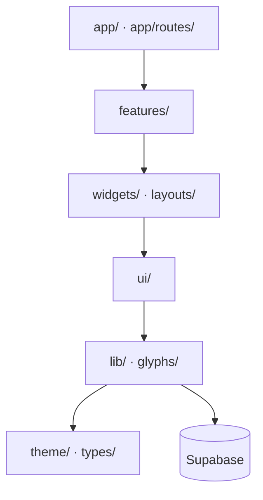

# Talrum Architecture & Security

Talrum is architected as an offline-capable, single-page React application backed by a structured Supabase database (Postgres + Auth + Storage). To maintain high reliability and prevent software decay, the system implements a strict layer-boundary contract on the frontend and an isolated schema layout on the backend database.

---

## 1. Strict 6-Layer Frontend Architecture

The frontend code is structured into six strict tiers. A layer may import from any layer *below* it, but is strictly prohibited from importing from any layer *above* it. 

The structure flows from top to bottom as follows:



### Layer Roles and Scope

1.  **`src/app/` (Composition Root):** Coordinates the root SPA router, the global session provider (`SessionProvider.tsx`), the central `AuthGate.tsx` which manages session lifetimes, and service worker update handlers. Under `src/app/routes/`, individual route pages are composed from independent feature views.
2.  **`src/features/` (Screens):** One isolated folder per screen/route (`parent-home`, `board-builder`, `kid-choice`, `kid-sequence`, `login`, `library`, `settings`). Features are designed to be self-contained; they must **never** import other features. They are composed exclusively at the route layer.
3.  **`src/widgets/` & `src/layouts/` (Shared, Query-Aware Components):** Shared, database-aware components that are feature-agnostic. Examples include `PictogramSheet`, `KidSheet`, `OfflineIndicator`, and layouts like `ParentShell` or `KidModeLayout`.
4.  **`src/ui/` (Presentational Primitives):** Core visual building blocks (`Button`, `Modal`, `PictoTile`, `TextField`, `Toggle`, `Segmented`). To maintain modularity, **components in the `ui/` layer are domain-agnostic and are strictly prohibited from importing data-access elements.**
5.  **`src/lib/` & `src/glyphs/` (Core Engines):** Houses database query definitions (`queries/`), offline write plumbing (`outbox/`), storage URL signing, and speech engines. `src/glyphs/` contains hand-drawn SVG vectors representing standard pictograms, ensuring instant rendering without a network connection.
6.  **`src/theme/` & `src/types/` (Styling & Types):** Centralizes CSS design variables and tokens. It also houses database TypeScript definitions (`src/types/supabase.ts`), which are generated automatically and must never be edited manually.

---

## 2. ESLint-Enforced Import Boundaries

These strict layering boundaries are enforced at build time via `eslint.config.js`. Violating an import rule fails the build and blocks commits.

*   **Reverse Import Blockers:** Rules under `no-restricted-imports` block lower layers like `lib/` or `ui/` from referencing higher-level compositions in `app/`, `features/`, or `widgets/`.
*   **Feature-Level Isolation:** Features under `src/features/` are blocked from importing from other features (e.g. `src/features/parent-home/` cannot import from `src/features/settings/`).
*   **Presentational Isolation:** Components inside `src/ui/` cannot import `lib/queries/`, `lib/outbox/`, `lib/storage/`, `lib/pin/`, or the Supabase client directly. If a presentational primitive requires access to database queries or synchronization states, it must be elevated to a widget inside `src/widgets/`.
*   **CSS Module Side-Effect Guard:** Side-effect CSS imports (`import 'style.module.css'`) are banned. Vite's production minifier can drop these rules during tree-shaking. Instead, CSS Modules must be imported as specifiers:
    ```typescript
    import styles from './MyComponent.module.css';
    ```

---

## 3. Supabase Client Isolation

The database client configuration resides strictly in `src/lib/supabase.ts`. To prevent unstructured database interactions:
*   Frontend layouts, features, and widgets are **blocked by ESLint rules** from importing from `@/lib/supabase`.
*   **Reads** must go through React Query hooks located in `src/lib/queries/*` to facilitate caching.
*   **Writes** must dispatch to the custom queue located in `src/lib/outbox/` to support offline capabilities.

---

## 4. Secured Database Schema: The `private` Helper Model

To protect against security vulnerabilities, all database triggers and `SECURITY DEFINER` helper functions are placed inside a dedicated, non-exposed `private` schema.

```
PostgREST Client (Web API)
  │
  ├── USAGE allowed ──> public schema (tables: kids, boards, pictograms)
  └── BLOCKED         ──> private schema (triggers, RLS helper functions)
```

### Why a Schema-Move instead of `REVOKE EXECUTE`?
Supabase security guidelines recommend moving sensitive helper functions out of the exposed API schema rather than revoking execution rights on individual functions.

During Row-Level Security (RLS) evaluation, Postgres executes helpers like `private.is_board_owner` in the query planner. If `REVOKE EXECUTE` is applied to a helper that is referenced in an active RLS policy, executing a `SELECT` query under an API role (e.g., `authenticated` or `anon`) causes the Postgres query planner to crash due to a privilege violation, restarting the database server. 

By moving functions into a `private` schema, Postgres can still execute them internally during RLS evaluations because the API roles are granted `USAGE` on the schema:
```sql
GRANT USAGE ON SCHEMA private TO anon, authenticated, service_role;
```
However, because PostgREST only exposes schemas listed in `[api].schemas` (typically `public` and `graphql_public`), these security-definer helper functions cannot be accessed over the HTTP API (e.g., via `/rest/v1/rpc/<name>`).

### Security-Definer Helpers in `private`
The `private` schema houses five primary security-definer functions used across RLS policies:
1.  **`private.is_board_owner(b_id uuid) -> boolean`**: Checks if the active user owns the board (`owner_id = auth.uid()`).
2.  **`private.is_board_member(b_id uuid) -> boolean`**: Verifies if the active user has a row in the `board_members` table for the given board.
3.  **`private.is_board_editor(b_id uuid) -> boolean`**: Asserts whether the active user has a role of `'owner'` or `'editor'` on the board.
4.  **`private.is_owner_shared_with_me(p_owner_id uuid) -> boolean`**: Evaluates to true if the active user owns the target record or is a member of any board owned by `p_owner_id`. This centralizes sharing visibility rules for `kids` and `pictograms`.
5.  **`private.is_pictogram_storage_visible(p_object_name text) -> boolean`**: Parses the owner ID from the file path prefix of a storage object (`<owner_uuid>/<pictogram_uuid>.<ext>`) and evaluates visibility based on user ownership or shared board membership.

### Event-Trigger RLS Enforcement
To protect against human error during schema updates, an event trigger named `ensure_rls` is wired to the database's `ddl_command_end` hook. Whenever a new table is created in the `public` schema, it runs `private.rls_auto_enable()`. This automatically executes an `ALTER TABLE ... ENABLE ROW LEVEL SECURITY` statement, ensuring that no table is exposed to the public API without RLS policies.

---

## Concept Relationships

The system architecture forms the backbone of Talrum's security and code patterns:
*   The system architecture is configured through the deployment and verification runs detailed in [Operations & Verification](operations-testing.md).
*   The transaction integrity within this architecture relies on the offline model described in [Offline Synchronization](offline-sync.md).
