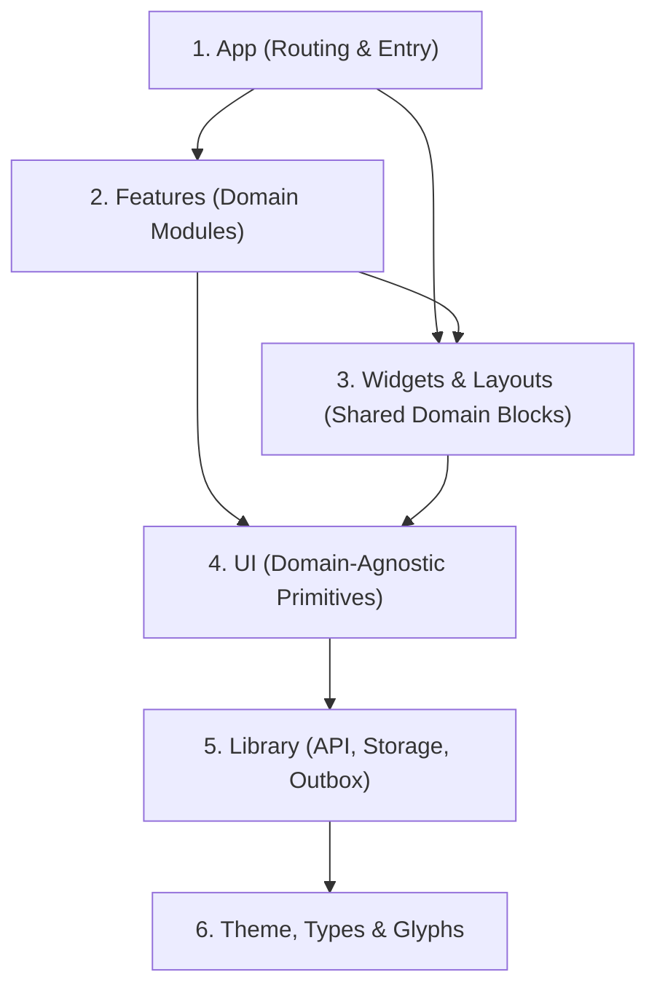

# Architecture Overview

Talrum is a single-page React application that relies on Supabase for its backend, encompassing a PostgreSQL database, authentication, and blob storage. The application is built for an offline-first experience, ensuring that typical usage works even in unstable network conditions, which is detailed in the [Offline Synchronization Model](offline-sync.md).

## Frontend Layering System

The frontend codebase enforces a strict six-layer architecture to prevent circular dependencies and maintain clean boundaries. A given layer may import from any layer beneath it, but never from a layer above it. The boundaries are enforced by static analysis tools configured in the repository root, as part of the broader [Operations & Quality Verification](operations-testing.md) strategy.

```mermaid
flowchart TD
    App["1. App (Routing & Entry)"]
    Features["2. Features (Domain Modules)"]
    WidgetsLayouts["3. Widgets & Layouts (Shared Domain Blocks)"]
    UI["4. UI (Domain-Agnostic Primitives)"]
    Lib["5. Library (API, Storage, Outbox)"]
    SharedBottom["6. Theme, Types & Glyphs"]

    App --> Features
    App --> WidgetsLayouts
    Features --> WidgetsLayouts
    Features --> UI
    WidgetsLayouts --> UI
    UI --> Lib
    Lib --> SharedBottom
```
*Unidirectional dependency flow enforced across the six frontend layers.*

From top to bottom, the layers are:

1. **App**: The entrypoint and routing layer (`src/app/`). It defines top-level routes and brings features together.
2. **Features**: Domain-specific modules and screens (`src/features/`).
3. **Widgets & Layouts**: Reusable functional blocks that handle domain logic and data access, and structural layouts (`src/widgets/`, `src/layouts/`).
4. **UI**: Core presentational components (`src/ui/`). This layer is strictly domain-agnostic and cannot access data-fetching plumbing like queries or the outbox.
5. **Library**: Domain plumbing, helpers, data fetching logic, outbox, storage, and platform integrations (`src/lib/`).
6. **Theme, Types & Glyphs**: The lowest level, containing design tokens, icon assets, and shared TypeScript definitions (`src/theme/`, `src/types/`, `src/glyphs/`).

The ESLint configuration (and the custom `scripts/verify-boundaries.mjs` script) explicitly enforces these unidirectional import rules.

## Backend Integration

The backend is fully provided by Supabase. The React application communicates directly with the database through PostgREST. The data model utilizes PostgreSQL constraints and row-level security (RLS) policies to enforce permissions, ensuring that caregivers only see and modify their own boards and resources. 

For authoring capabilities, Talrum uses Supabase Edge Functions (`supabase/functions/`) to generate pictogram images and neural text-to-speech voice clips. These functions integrate with external providers (like Azure AI) at authoring time, returning media that is subsequently stored and served like any other user upload.

Database schema definitions, types, and migrations are managed via the Supabase CLI, and TypeScript types are regenerated automatically when the schema is updated.
