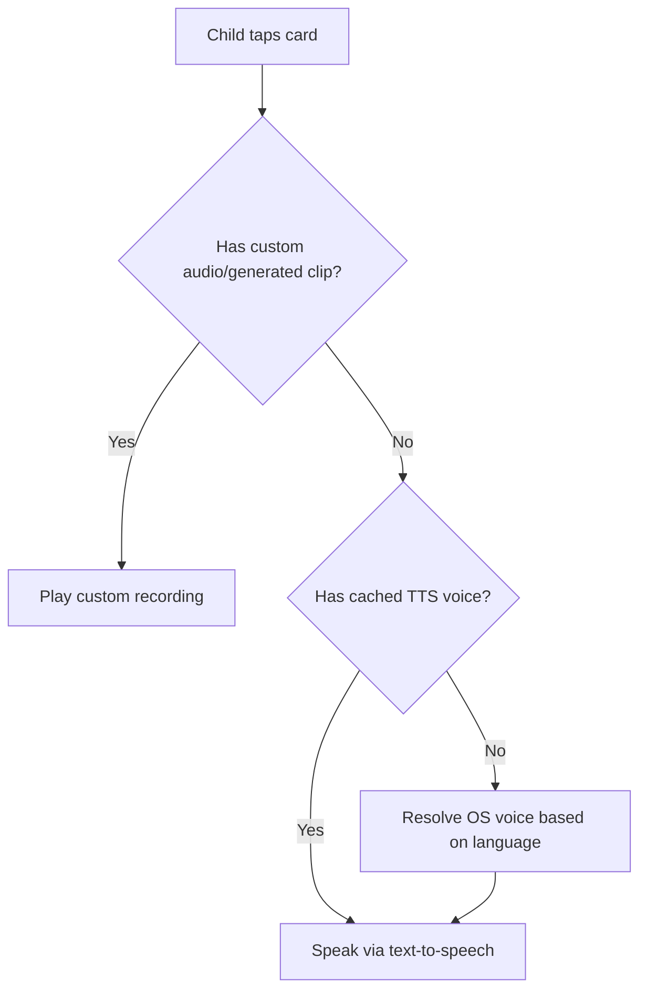

# Kid Mode & Speech Subsystem

Talrum is split into two distinct environments: a configuration interface for caregivers and a low-stimulus communication interface for children, which operate within the strict boundaries defined in the [Architecture Overview](architecture.md).

## Kid Mode Interface

The child interface is built to occupy the entire screen, optimized for a tablet in landscape orientation. It is entirely tap-driven and devoid of complex navigation, spinners, or extraneous badges to prevent sensory overstimulation, relying on the [Offline Synchronization Model](offline-sync.md) to instantly resolve interactions.

### Board Types

The interface adapts depending on the type of board a caregiver has created:
*   **Choice Boards** (`KidChoice`): Present a set of pictograms side-by-side. Tapping a card registers a choice visually and speaks the associated word.
*   **Sequence Boards** (`KidSequence`): Guide a child through a linear task (like washing hands). Children can interact with the steps as they progress.

### The Soft PIN Gate

To prevent accidental exits into the configuration screens, Kid Mode is protected by a client-side PIN gate (`src/widgets/KidModeGate/`). 
*   **Hard Requirement**: A device with no stored PIN cannot enter Kid Mode. Accessing a Kid Mode route without a PIN triggers a hard redirect to the parent settings to set one up.
*   **Soft Boundary**: The PIN is hashed before being stored locally; it is a soft boundary to keep a child within the interface, not cryptographic security.
*   **Throttling**: To deter older siblings from brute-forcing the exit, incorrect PIN entries at the exit gate are exponentially throttled (up to 5 minutes of visual lockdown). The counter resets only when the application is reloaded.

## Speech Synthesis

When a card is tapped, the application plays auditory feedback. Caregivers can record custom audio prompts (or generate high-quality neural TTS clips at authoring time), which take precedence. If no custom recording or generated clip is provided, the application falls back to the browser's native text-to-speech engine.

*Audio playback resolution flow prioritizing custom recordings over local text-to-speech.*

Because fetching available system voices can be asynchronous, the application caches its preferred voice selection. A heuristic is used to pick an appropriate local voice based on the chosen language, falling back to English if necessary. Caregivers can override the heuristic by manually selecting a preferred device voice in the settings, or bypass local TTS entirely by generating a persistent neural voice clip using the backend AI integrations during board building or directly from the central library.

**Kid-Visible Copy**: All language strings rendered inside Kid Mode (including the PIN pad) are strictly maintained in a single translation file (`src/lib/kidCopy.ts`). This ensures every string a child sees can be audited and translated safely without leaking parent-mode chrome.
