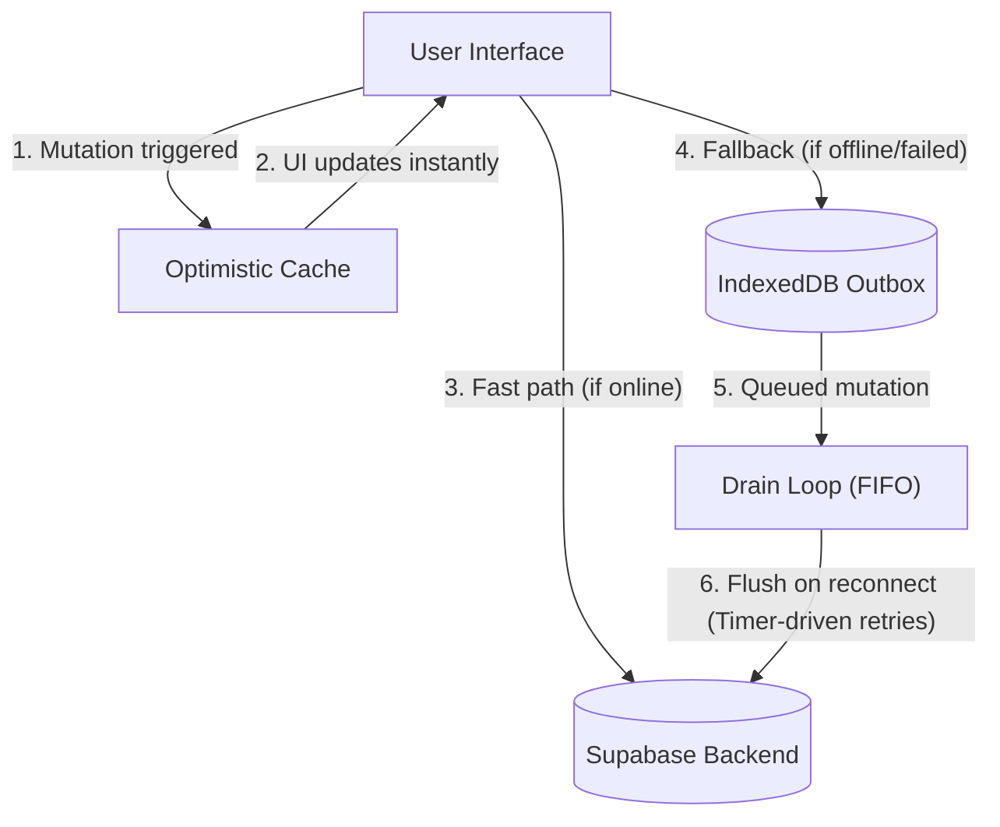

# Offline Synchronization Model

Talrum is designed for environments where network connectivity may be spotty or entirely absent. Because even a brief loading state could cause distress for the user, particularly within the [Kid Mode & Speech Subsystem](kid-mode-speech.md), all data mutations are designed to resolve instantly in the UI.

## Optimistic UI and the Outbox Queue

When a mutation occurs (like updating a board or adding a new pictogram), the change is immediately applied to the local optimistic cache. This ensures the user interface never blocks on a network request. 

*Data flow of a mutation through the optimistic cache and offline outbox queue.*

Concurrently, the application attempts a fast path: if the network is available, it pushes the change directly to the backend. If the application is offline or the network request fails, the mutation payload is serialized and placed into an outbox queue backed by IndexedDB. The global UI reflects these offline queued changes steadily via timer-driven polling mechanisms inside the drain and indicator components.

## The Drain Loop and Replay

Mutations stored in the outbox are assigned a unique lexicographically sortable identifier to maintain strict time-ordering. A background drain process constantly monitors the queue and network status. Once connectivity is restored, the drain loop flushes pending entries in a first-in, first-out (FIFO) order. 

To prevent concurrent drain loops from executing simultaneously across multiple browser tabs, the system employs cross-tab locking via the Web Locks API.

## Media Offline Caching & Storage Artifact Safety

Because outbox operations like image or audio uploads can be delayed during flaky connections, storage objects are designed to be idempotent and immune to race conditions. Rather than uploading to deterministic paths—which could cause a delayed, older upload to overwrite a newer one—every media upload is assigned a unique, versioned path (e.g., suffixed with a ULID) at the time of queuing. 

To support offline media viewing, Talrum extensively uses the Service Worker cache on downloaded URLs:
*   **Images**: Signed URLs are cached locally so the Service Worker can serve them offline without roundtripping to mint a new signature.
*   **Audio**: Because standard HTML media elements send a `Range` header that results in a `206 Partial Content` response (which the Service Worker cache rejects), audio playback uses a fetch-to-blob strategy. The file is fetched normally to get a `200 OK` response that the cache accepts, and played locally via an object URL.

When an outbox handler executes, the database row acts as the single source of truth for the current media path. Instead of relying on client-side snapshots that might become stale, handlers read the active storage path directly from the row before performing any cleanup. 

**Auth Boundary Cleansing**: To ensure data privacy between different parent accounts on a shared device, all caches (Service Worker, IndexedDB queries, and signed URLs) are completely wiped during authentication boundaries (sign in / sign out) in `src/lib/queryClient.ts`.

## Conflict Handling

To prevent silent overwrites when multiple devices edit the same board concurrently, updates are guarded by checking the backend's last known update timestamp. If a patch attempts to modify a board that has been changed on the server since the local device last synced, the mutation will intentionally fail. 

Failed entries remain in the outbox queue. The system distinguishes between transient and permanent errors:
*   **Transient Errors**: Network failures, 5xx server errors, or PostgreSQL coordination codes (e.g., deadlocks, connection drops, statement timeouts) leave the entry pending for automatic retry on the next drain loop.
*   **Permanent Errors**: For unretryable coded database errors (like RLS denial or validation violations), 4xx storage errors, or a concurrency conflict (the backend timestamp has changed since the local device last synced), the outbox marks the entry as failed and surfaces it in the UI. The optimistic state is rolled back, requiring the user to explicitly retry or discard their changes.
